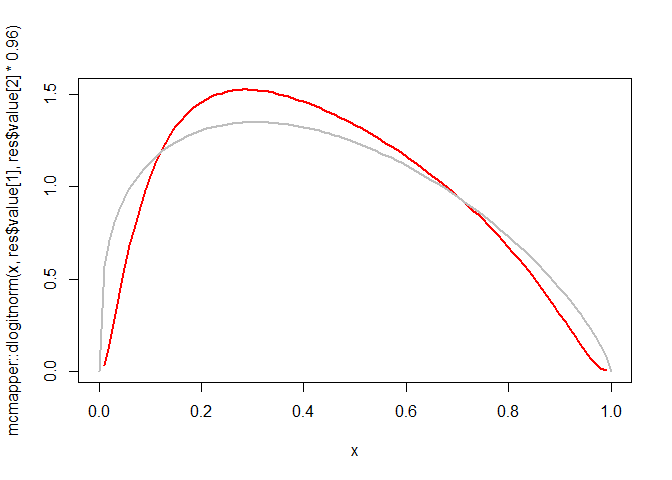

<!-- README.md is generated from README.Rmd. Please edit that file -->

# mcmapper

<!-- badges: start -->
<!-- badges: end -->

The goal of mcmapper is to enable estimating the parameters of
two-parameter distributions for risks (e.g., beta, logit-normal) based
on the expected value and c-statistic of the distribution.

Some of the recent developments in predictive analytics, such as [new
methods for sample size calculations for risk prediction
models](https://doi.org/10.1002/sim.9025), require knowing the
distribution of predicted risks. However, original reports seldom
provide such information. On the other hand, prediction model
development and validation studies most often report the expected values
of predicted or observed risks, and the c-statistic of the model for
predicting the outcome. For a given family of distributions, one can use
this package to recover the parameters of such a distribution.

The uniqueness of the characterization is established in a forthcoming
paper.

## Installation

You can install the development version of mcmapper from
[GitHub](https://github.com/) with:

``` r
# install.packages("devtools")
devtools::install_github("resplab/mcmapper")
```

## Example

Gupta et al validated their risk prediction model for the risk of
deterioration in hospitalized patients with COVID-19 infection. In the
external validation sample (from London, UK), the prevalence of
deterioration was 43%, the model had a c-statistics of 0.77. The model
was well calibrated. The model was only slightly miscalibrated
9calibration intercept of 0 and slope of 0.96). The calibration plot was
monotonic. This means the c-statistic relating predicted risks with
observed outcomes remains the same for relating calibrated risks and
observed outcome.

Working with the logit-normal distribution, and recover the distribution
of calibrated risks:

``` r
library(mcmapper)

res <- mcmap(c(m=0.43, c=0.77), type="logitnorm")

res
#> $type
#> [1] "logitnorm"
#> 
#> $value
#>       mu.m      sigma 
#> -0.3605462  1.1836304 
#> 
#> attr(,"class")
#> [1] "mcmapper_output"
```

Given the information provided on the calibration slope and intercept,
the distribution of predicted risks will be specified as

$\pi \sim logitnom(-0.3605462,1.1362852)$. For comparison, we overlay
the Beta(1.33, 1.75) that Riley et al estimated using the provided
histogram (gray line).

``` r
x <- (0:100)/100

plot(x,mcmapper::dlogitnorm(x, res$value[1], res$value[2]*0.96),col='red',type='l', lwd=2)
#lines(x,mcmapper::dlogitnorm(x, res$value[1], res$value[2]*0.96),col='blue',type='l')
lines(x,dbeta(x,1.33,1.75),type='l', col='gray', lwd=2)
```


