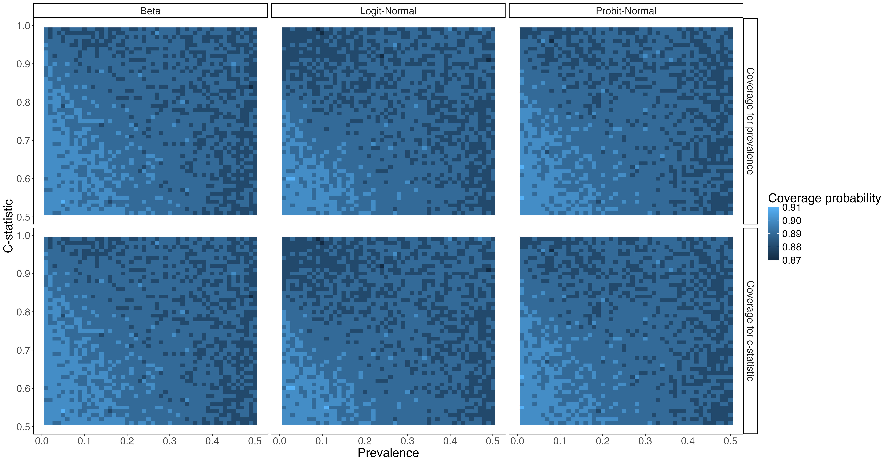

```{r setup, include=FALSE}
knitr::opts_chunk$set(echo = TRUE)
```


# Background
In risk prediction modeling, the performance of a model is often times summarized in metrics of discrimination. However, several methodologies require knowing the distribution of predicted risks. For example, contemporary sample size calculations for external validation of prediction models require knowledge of the distribution of the predicted risks in the future sample [REF]. Similarly, in Value of Information analysis for external validation studies, the joint uncertainty around the net benefit of a model and treating all is seldom reported, but can be inferred from knowing the distribution of predicted risks.

Often times, however, the distribution of predicted risks in a sample are not directly reported in studies in predictive analytics, leaving the investigators to infer this distribution indirectly, for example, from the visual information provided in the calibration plots. On the other hand, many development or validation studies report on summary statistics such as c-statistics, as well as sample average of predicted risks (or the prevalence of the outcome, and the bias in the average predicted risk, aka mean calibration). There is partial information in these metrics that can provide insight into the distribution of predicted risks. Generally speaking, average value of predicted risks is associated with the location of the central mass of the distribution, while the c-statistic provides indirect information about the spread of predicted risks (models with low c-statistic have concentrated mass, while those with high c-statistic are generally more spread).

This report builds on such intuition, and provides core theories and their basic implementation for deriving the distribution of predicted risks from their expected value and c-statistic. The derivations give rise to a generic way for the implmentation of a mapping algorithm, whose performance is tested in brief simulation studies.

# Methods

Consider a parametric family of probability distributions with support on [0,1], with the following characteristics:

- The CDF is strictly monotonic.
- The distribution is quantile-identifiable: knowing any pair of quantiles would fully identify the distribution.

We note that common two-parameter distributions for probabilities, such as beta ($\pi\sim Beta(\alpha,\beta)$), \mbox{logit} normal ($\mbox{logit}(\pi) \sim Normal(\mu,\sigma^2)$, where $\mbox{logit}(\pi):=\mbox{log}(\pi/(1-\pi))$) and probit-normal ($\Phi^{-1}(\pi) \sim Normal(\mu,\sigma^2)$ where $\Phi(x)$ is the standard normal CDF) satisfy the above criteria. All these distributions have strictly monotonic CDFs.  The quantile-identifiability of the beta distribution is proven in [Shih (doi:10.1080/00949655.2014.914513)](https://www.tandfonline.com/doi/full/10.1080/00949655.2014.914513). For the \mbox{logit}-normal and probit-normal distributions, it is immediately deduced from the monotonical link to the normal distribution and the quantile-identifiability of the latter.


## Lemma

For a family of probability distributions with the above characteristics, the combination of expected value and c-statistic uniquely identifies the distribution.


## Proof
Let $F$ be the CDF from the family of distributions of interest. Let $m$ be its first moment, and $c$ its c-statistic, defined as $c:=P(\pi_2 > \pi_1 | Y_2=1, Y_1=0)$ where $\pi_i \stackrel{iid}{\sim} F$ and $Y_i\sim Bernoulli(\pi_i)$. $c$ is the probability that a random draw from the distribution of $\pi$ among 'cases' (those with $Y=1$) is larger than a random draw from its distribution among 'controls' (those with $Y=0$). We shall prove that $F$ is uniquely identifiable from {$m$, $c$}.

First, we use the standard results that for $\pi$ as a non-negative RV  $\mathbb{E}(\pi)=1 - \int_0^1  F(x)dx$. Thus, knowing $m$ is equal to knowing the area under the CDF. Next, applying Bayes' rule to the distribution of $\pi$ among cases ($P(\pi|Y=1)$) and controls ($P(\pi|Y=0)$) reveals that the former has a PDF of $xf(x)/m$ and the latter $(1-x)f(x)/(1-m)$, where $f(x):=dF(x)/dx$ is the PDF of $F$. Thus we have:

$m(1-m)c=\int_0^1[xf(x)\int_0^x(1-y)f(y)dy]dx=\int_0^1[xf(x)\int_0^x f(y)dy]dx-\int_0^1[xf(x)\int_0^x yf(y)dy]dx=\int_0^1xf(x)F(x)dx-\int_0^1g(x)G(x)dx$, where $g(x)=xf(x)$ and $G(x)=\int_0^x yg(y)dy$. Integration by parts for both integrals results in

$m(1-m)c=\frac{1}{2}xF^2(x)|_0^1-\frac{1}{2}\int_0^1F^2(x)dx-\frac{1}{2}G^2(x)|_0^1=\frac{1}{2}-\frac{1}{2}\int_0^1F^2(x)dx-\frac{1}{2}m^2$

i.e., among the subset of $F$s with the same $m$, $c$ is monotonically related to $\int_0^1F^2(x)dx$. As such, the goal is achieved by showing that {$\int_0^1F(x)dx$, $\int_0^1F^2(x)dx$} uniquely identifies $F$. Given that $\int_0^1F^2(x)dx=1-\mathbb{E}max(X_1,X_2)$ where $X_1$ and $X_2$ are iid random variables from $F$, the two integrals are related to the first two order statistics and as such,  characterization theories based on order statistics can be invoked for identifiability of distirbutions[REF]. We are, however, not aware of any results from the order statistics literature that establishes the characterization of the family of the distribution defined in this work, and proceed to provide a proof for the lemma. The proof is achieved by showing that two different CDFs $F_1$ and $F_2$ with the same $\int_0^1F(x)dx$ cannot have the same $\int_0^1F^2(x)dx$. 

Given that both CDFs are anchored at (0,0) and (1,1), are monotonical, and have the same area under the CDF but are not equal at all points, they must cross. However, they can only cross once, given the quantile-identifiability requirement (if they cross two or more times, any pairs of quantiles defined by the crossing points would fail to identify them uniquely).

Let $x^*$ be the unique crossing point of the two CDFs, and let $y^*=F_1(x^*)=F_2(x^*)$ be the CDF value at this point. We break $\int_0^1(F_1^2(x)-F_2^2(x))dx$ into two parts around $x^*$:

$\int_0^1 (F_1^2(x)-F_2^2(x))dx=\int_0^{x^*} (F_1^2(x)-F_2^2(x))dx+\int_{x^*}^1 (F_1^2(x)-F_2^2(x))dx=\int_0^{x^*} (F_1(x)-F_2(x))(F_1(x)+F_2(x))dx+ \int_{x^*}^1 (F_1(x)-F_2(x))(F_1(x)+F_2(x))dx$.

Without loss of generality, assume we label $F$s such that $F_1(x) > F_2(x)$ when $x \in (0,{x^*})$. In this region,  $F_1(x)-F_2(x) > 0$, and (due to the CDFs monotonically increasing) $0<F_1(x)+F_2(x) < F_1({x^*})+F_2({x^*}) =2y^*$. As such, replacing $F_1(x)+F_2(x)$ by the larger positive quantity $2y^*$ will increase this term. As well, in the $x\in ({x^*},1)$ region, $F_1(x)-F_2(x) < 0$, and $0<F_1({x^*})+F_2({x^*})=2y^*<F_1(x)+F_2(x)$. As such, replacing $F_1(x)+F_2(x)$ by the smaller positive quantity $2y^*$ will also increase this term. Therefore we have

$\int_0^1 (F_1^2(x)-F_2^2(x))dx < 2y^*(\int_0^{x^*} (F_1(x)-F_2(x))dx+\int_{x^*}^1 (F_1(x)-F_2(x)))dx$, and the term on the right-hand side is zero because of the equality of the area under the CDFs. Therefore, $\int_0^1 (F_1^2(x)-F_2^2(x))dx < 0$.


## Implementation
We have implemented a set of numerical algorithms for finding the parameters of distributions of the above-mentioned class given a known mean and c-statistic in the accompanying **mcmapper** R package[REF]. Our implementation is informed by the above developments, in particular the two equalities for any distribution with the required characteristics:

$\int_0^1F(x;\lambda)dx = 1-m$;

$\int_0^1F^2(x;\lambda)dx = 1-2cm+(2c-1)m^2$,

where $\lambda$ is the set (typically a pair) of parameters indexing the distribution.

The CDF and its square for the class of distributions that satisfy the identification requirement are generally well-behaved: they are smooth, strictly monotonical functions within the unit square. As such, these integrals can, for the most part, be evaluated using a general numerical integrators. Finding this system of equations can also be programmed as a two-variable optimization problem, for example via gradient descent algorithm that finds the value of $\lambda$ that minimizes the quadratic error ($\int_0^1F(x;\lambda)dx-[1-m])^2+(\int_0^1F^2(x;\lambda)dx-[1-2cm+(2c-1)m^2])^2$. The **mcmap()** function in the **mcmapper** package implements this general algorithm for any unspecified CDF that is indexed by two parameters. It relies on base R's **integrate()** function for computing the two integrals, and base R's **optim()** function for the gradient descent component.  

This generic mapping algorithm can be improved for specific cases. For example, for the beta and probit-normal distributions, knowing $m$ immediately solves for one of the two distribution parameter. For the beta distribution, the relationship is $m=\alpha/(\alpha+\beta)$. As such, the optimization problem can be reduced to a one-dimensional root-finding one: by solving for $\alpha$ in $\int_0^1\mathcal{B}^2(x;\alpha,\alpha\frac{1-m}m)dx = 1-2cm+(2c-1)m^2$, where $\mathcal{B}$ is the beta distribution CDF (i.e., incomplete beta function). The **mcmap_beta()** function implements this approach.  For probitnormal distribution, the relationship is $\Phi(\mu/\sqrt(1+\sigma^2))=m$. Again, expressing $\mu$ as a function of $m$ and $\sigma$ reduces the problem to one-dimension root-finding, solving for $\sigma$ in $\int_0^1\Phi^2(\frac{x-\Phi^{-1}(m)\sqrt(1+\sigma^2)}{\sigma})dx = 1-2cm+(2c-1)m^2$ (one can alternatively express $\sigma$ in terms of $m$). The **mcmap_probitnorm()** function implements this algorithms.

For \mbox{logit}normal distribution, moments are not analytically expressible[REF], and our implementation of **mcmap_\mbox{logit}normal()** is based on the gradient descent algorithm fine-tuned for this particular case (e.g., log-transforming $\sigma$ to enable unconstrained optimization).


## Brief simulation studies
We conducted a simulation study to verify the validity of our algorithm. Using a simulation-based calibration approach (Section 4 of @gelman2020bayesian), we sought to verify whether our algorithm could successfully recover the two parameters of the beta, logit-normal, and probit-normal distributions for given prevalence $\pi$ and c-statistic $c$ values. For each of $\pi=0.01, 0.02, \dots, 0.49, 0.50$ and $c=0.51, 0.52, \dots, 0.98, 0.99$, we first used our algorithm to estimate the two parameters for each of the three distributions. Next, we drew $n_{inner} = \frac{10}{\pi}$ number of $\pi_i$ from the distribution with the estimated parameters, drew $n_{inner}$ samples from the binomial distribution with probability $\pi_i$ (implying the effective sample size is 10 on average), calculated the sample prevalence $\hat \pi$ and sample c-statistic $\hat c$ along with their $(1-\alpha)\%$ CIs, and checked whether $\pi$ and c-statistic were contained in the corresponding CIs. We iterated this process for $n_{outer}=10,000$ times, calculated the corresponding coverage probabilities (i.e., the proportion of times each target value was contained), and checked whether they were close to the target coverage probability of $(1-\alpha)\%$. We set $\alpha=0.10$ in our simulation study.

Simulation results illustrate that our algorithm could recover the parameters successfully for typical prevalence and c-statistic values (Figure \@ref(fig:sim-fig)). However, we observed that the coverage probabilities modestly deviated from the target value (90\% in our case) for extreme values (left corners and right corners in the figure), indicating limitations of the implemented optimization method for handling such extreme values.

```{r sim-fig, fig.cap = "Coverage probabilities of the prevelance (top) and c-statistic (bottom) by each of the beta (left), logit-normal (mid), and logit-probit (right) distributions based on 10,000 simulation runs, with the target coverage probabiltiy of 90%",echo=F,out.width='100%'}

```

## Remarks
An area of application for these results is sample size calculations for risk prediction models. Such methods generally require an estimation of the variance of predicted risks in the target population[REF], a quantity that is seldom reported. However, the majority of validation studies report the c-statistic (alone or alongside the Receiver Operating Characteristic curve) and the average value of predicted risks. One can then use these results to obtain an estimate for the variance. Different families of distributions can be used in the form of sensitivity analysis.

To test the numerical accuracy of our proposed algorithm for mapping mean and c-statistic to the parameters of two-parameter distributions, we focused on a plausible range of mean and c-statistic. These algorithms might struggle at extreme ranges, especially for the c-statistic (e.g., for $c<0.51$ or $c>0.99$). This is because the CDF can be very flat (within the floating point precision of the computing device) in extended parts of its range in such cases, making numerical integration inaccurate. As well, the surface of the function mapping $\{$m$,$c$\}$ to $\lambda$ might be flat (within the floating point precision) around the solution in such extreme cases, causing the gradient descent algorithm to fail to converge.  In general, extreme values of the c-statistic are not plausible in real-world situations. A c-statistic that is too high, for example, might indicate a complete. Reciprocally, a c-statistic that is very close to 0.5 signals no variability in risks. In such situations, modeling the risk as a continuous distribution might be doubtful. 

Do these developments apply to other measures of centrality such as median and mode? This is obvious for specific cases. For example, for both \mbox{logit}-normal and probit-normal distributions, knowing the median directly identifies $\mu$; and $\sigma$ is then uniquely determined by $c$. As well, the mode of beta distribution establishes a linear relation between its parameters, so one can express one parameter in terms of the other given the mode, and solve the remaining parameter by knowing $c$. However, there are counterexamples that show that under the regularity conditions proposed here, the lemma is not generally applicable to median or mode. To generate such counter-examples, we use the above-mentioned property that $\pi \rightarrow 1-\pi$ preserves the c-statistic. For the case of mode, consider the family of distributions indexed by a single parameter $a \in [0,1]$, constructed by a mixture of two triangular distributions such that 3/4 of its mass is from the triangular distribution $(0,0.5,1)$ and 1/4 from $(0,a,1)$. This family of distributions satisfies the regularity conditions [TODO: double-check]. The mode of any member of this family is at $x=0.5$. The transformation $\pi \rightarrow 1-\pi$ results in another, distinct distribution from this family (corresponding to $a \rightarrow 1-a$ transformation) with the same mode and c-statistic, thus showing that mode and c-statistic cannot uniquely identify members of this family. A similar counterexample can be constructed for the median: we can construct a family of distributions indexed by $a \in [0,0.5]$ which is based on equal mixture of two triangular distributions $(0,a,0.5)$ and $(0.5,0.5+a,1)$. This family satisfies the regularity conditions, with all members having the same median of 0.5. But again, the transformation $\pi \rightarrow 1-\pi$ generates the another family of from this distribution corresponding to $a \rightarrow 0.5-a$, with the same median and c-statistic. The above line of reasoning was based on the fact that the transformation $\pi \rightarrow 1-\pi$ does not affect the c-statistic. Applying this transformation also preserves the mean when $m=0.5$. Given the main results in this paper, the family of distributions that satisfy the regularity conditions must either be symmetric when $m=0.5$ such that this transformation results in the exact same distribution, or such transformation should not result in another member from the same family.


On the other hand, this proof can be extended to some other metrics of dispersion. For example, if instead of c-statistic, one knows the Gini index, due to the unique relationship between the c-statistic and Gini[REF], these results are applicable.

# References

@article{gelman2020bayesian,
  title={Bayesian workflow},
  author={Gelman, Andrew and Vehtari, Aki and Simpson, Daniel and Margossian, Charles C and Carpenter, Bob and Yao, Yuling and Kennedy, Lauren and Gabry, Jonah and B{\"u}rkner, Paul-Christian and Modr{\'a}k, Martin},
  journal={arXiv preprint arXiv:2011.01808},
  year={2020}
}


